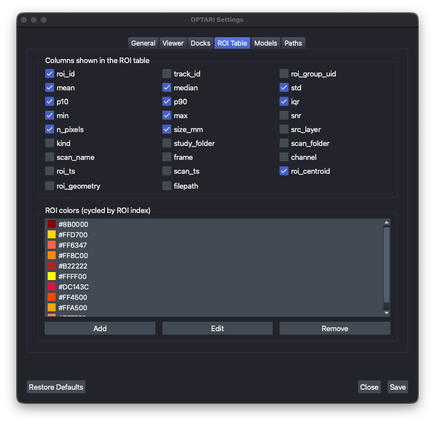
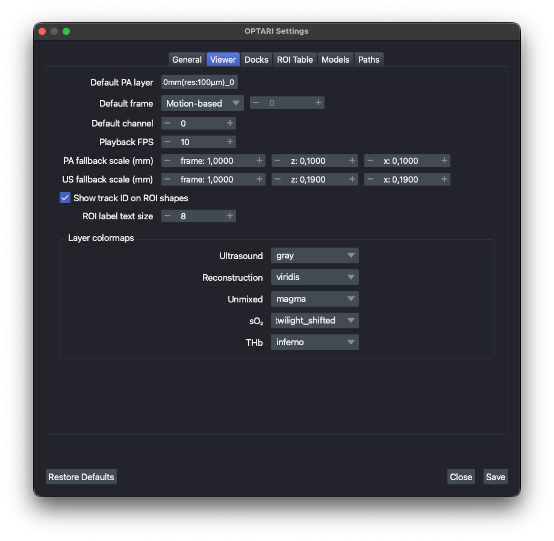

# Configuration

Most OPTARI settings can be changed from inside the app. Open **OPTARI → Settings…** in the menu bar.
Any dock can be shown or hidden from **OPTARI → Docks**.

<div class="grid" markdown>





</div>

| Tab | Available Settings |
|---|---|
| General | Operator name, log verbosity, histogram bin count |
| Viewer | Default layer/frame/channel selected when a scan loads, playback speed, fallback pixel scale, layer colormaps |
| Docks | Which panels are visible when OPTARI starts |
| ROI Table | Which columns the Live Analysis table shows, the ROI color palette |
| Models | The segmentation model registry and the default model (read-only) |
| Paths | Where your config, presets, models, and log file are stored (read-only) |

!!! note
    Settings are read once at startup, so changes take effect after you **restart OPTARI**.

Reconstruction, unmixing, ROI, and segmentation presets are not edited here. Each has its own
**Save Preset** / **Remove Preset** controls in its own dock. See [Presets](presets.md).

## Editing settings from file

OPTARI's settings and presets are stored in the `~/.optari/` folder as human-readable JSON. This folder is created on first launch and filled with defaults. The full reference can be found in
[Configuration Schema](configuration-schema.md). The same restart-required rule applies.

```
~/.optari/
├── config/
│   ├── config.json                  # main application settings
│   ├── segmentation_models.json     # segmentation model registry
│   └── presets/
│       ├── reconstruction/*.json
│       ├── unmixing/*.json
│       ├── roi/*.json
│       └── segmentation/*.json
├── autosave/                        # one roi_table_<date>T<time>_<pid>.xlsx backup per session, newest 20 kept
├── logs/                            # one optari_<date>T<time>_<pid>.log per session, newest 20 kept
└── models/                          # downloaded segmentation model weights
```

