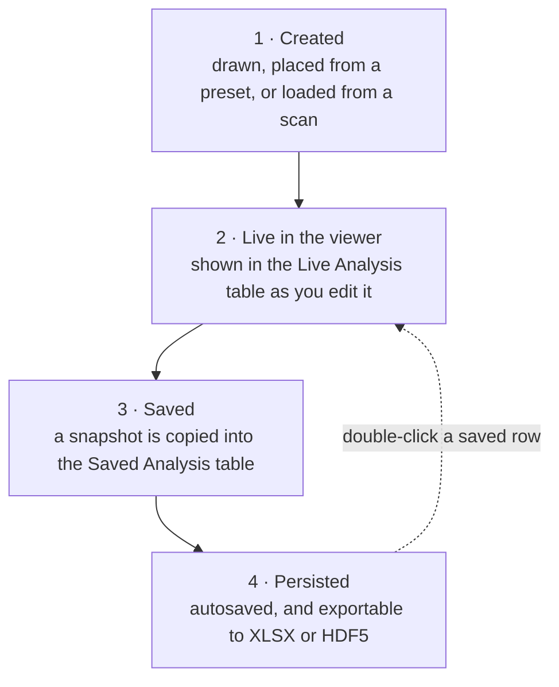
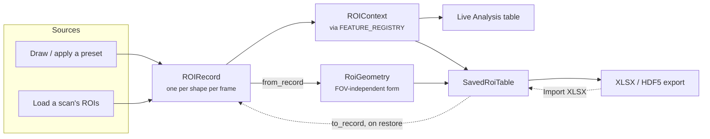

# The ROI System

Regions of interest are the main measurement tool in OPTARI: everything in the
Saved Analysis table, the time and spectral plots, and the ROI parts of the HDF5 export 
comes from one. This page describes how an ROI is represented.

The challenge is to keep the ROI correct and persist across multiple transitions:

- **Between frames.** One drawn region may exist on every frame of a sequence (e.g. when preset scope is all frames), and those
  copies must stay recognisable as the same region.
- **Between reconstructions.** The same anatomy may be measured on layers with different
  pixel grids and different fields of view.
- **Between sessions and machines.** The saved table should survive a crash, we should be able to resume a previous analysis, and be able to import/export it to a new machine.

All that without ROIs colliding, unintended duplication or loss of data.

## Lifecycle

The following diagram shows the stages one ROI passes through:



While the next one shows the involved classes:



## The three identifiers

The most common source of confusion is that an ROI carries three IDs. They exist at
different scopes and are not interchangeable.

| Identifier | Type | Scope | Purpose |
|---|---|---|---|
| `roi_id` | `int` | session | One shape on one frame. Allocated from a counter, and used for display ordering and colour. |
| `track_id` | `int` | session | The tracked group a shape belongs to — the same region followed across frames. What the analysis plots aggregate on. |
| `roi_group_uid` | `str` | global | The group's stable identity, e.g. `20260828T115300-5127328a2658`. Survives export, import, restore and other machines. |

!!! warning "Group by `roi_group_uid`, never by `roi_id`"
    `roi_id` and `track_id` are per-session counters. After importing a table, or when
    merging exports from two machines, two unrelated ROIs can share them. Only
    `roi_group_uid` is safe as a grouping key, in code and in downstream statistics alike.


**Every record in a group shares one `roi_group_uid`.** A uid identifies a **region**, not a measurement of it. Copying a shape to another frame,
merging shapes into a group, or interpolating between keyframes all mean giving the results
a common uid. `ROIRecord` creates a fresh one by default, so any code that copies a record
must pass the source's uid explicitly.

To uniquely identify a measurement, `roi_ts`, created once per save, can be used. `new_roi_group_uid()` in `roi_records.py` creates roi_group_uid as a UTC timestamp plus 48 random bits.

## `ROIRecord`

```python
@dataclass
class ROIRecord:
    roi_id: int
    track_id: int
    frame_id: int
    verts: np.ndarray          # napari (y_mm, x_mm)
    kind: str                  # "polygon" | "ellipse" | "line" | ...
    source: str = OPTARI_SOURCE_TAG
    tissue_class: str = "undefined"
    roi_group_uid: str = field(default_factory=new_roi_group_uid)
```

Records are **frame-owned**: there is one per (shape, frame), not one shape with a list of
frames. `RoiController` holds them in `self._roi_records: dict[int, ROIRecord]`, keyed by
`roi_id`, and this dict is the single source of truth. The napari Shapes layer is a
projection of it:

- `project_current_frame()` writes the current frame's records into `shapes.data`, and
  records the display order in `self._projection_ids` (display index → `roi_id`).
- `sync_records_from_shapes()` reads user edits back. Ids are matched positionally, since
  napari appends new shapes at the end and in-place edits keep their position.

`source` is the provenance tag, `OPTARI_v<version>` for anything OPTARI drew, or the
originating `roi_class` for ROIs loaded from a scan. Editing a loaded ROI sets it to
`OPTARI_v<version>`. HDF5 export writes `source` as PATATO's `roi_class`, replaces the
stored ROIs whose class starts with `OPTARI` with the session's records, and leaves every
other stored ROI untouched.


## `RoiGeometry`

Everything OPTARI writes to disk uses `RoiGeometry` (`roi_geometry.py`): vertices in
**PATATO coordinates**, metres, origin at the image centre.

### Why not napari mm?

napari coordinates are millimetres relative to the field of view corner. The same
physical point therefore has different napari coordinates on two reconstructions with
different fields of view.


| | Origin | Axes | Units |
|---|---|---|---|
| napari | top-left of the FOV | y down, x right | mm |
| PATATO | image centre | y up, x right | m |

`patato_to_napari()` and `napari_to_patato()` are the only two places for that and
every conversion in the codebase goes through them.

### 3 coordinate frames

| Frame | Use | Anchored to |
|---|---|---|
| **world mm** | `ROIRecord.verts`, always | the viewer's shared physical space |
| **PATATO metres** | `RoiGeometry.verts_m`, everything persisted | the scan's FOV centre |
| **layer pixels** | mask indices | one layer's own array |

A layer can be placed at a nonzero `translate`, its own offset within world space. The Shapes layer carrying ROIs is never translated, so ROI vertices are always world mm, and
scan-loaded layers sit at translate 0.

`roi_centroid` is left in **world** mm on purpose. It is an informative column only, never
round-tripped back into a shape.

### The type

`RoiGeometry` holds `verts_m`, `kind`, `tissue_class` and `source`, which is everything needed to
rebuild an `ROIRecord` and converts in both directions:

```python
geometry = RoiGeometry.from_record(record, fov_x_m, fov_y_m)
record   = geometry.to_record(roi_id=..., track_id=..., frame_id=...,
                              roi_group_uid=..., fov_x_m=..., fov_y_m=...)
blob     = geometry.to_json()          # the roi_geometry table column
geometry = RoiGeometry.from_json(blob)
```

It does **not** carry any identifier. Geometry is shape, identity is
`ROIRecord`. Keeping them apart is what lets one preset be placed many times,
each placement getting its own identity.

## Measurement: `ROIContext` and the feature registry

Statistics are computed by a registry, so adding a measurement only requires a one-line change.

`ROIContext` (`roi_features.py`) is an bundle of everything a single measurement needs: the identifiers, provenance (`scan_name`, `frame`, `channel`, `src_layer`,
timestamps), the geometry blob, and the pixel values (`vals_raw`, the clamped `vals`, the
scale, the vertices).

The functions in `roi_utils.py` that measure ROIs share three pieces:

`iter_roi_masks(records, layer, image_shape)`
    Yields each usable ROI with its mask, and is the only place that turns a world-space ROI
    into pixel indices.
`IntensityClamp`
    The ROI intensity filter `clip` bounds outliers into range. `exclude` drops them, which also changes `n_pixels` and `size_mm`.
    The default instance is a no-op
`_LayerInfo` / `_roi_context`
    Per-layer constants resolved once per call rather than per ROI.

`FeatureSpec` pairs a dtype with a function from context to value, and `FEATURE_REGISTRY`
maps a column name to a spec:

```python
FEATURE_REGISTRY: dict[str, FeatureSpec] = {
    "roi_id": FeatureSpec(int, lambda c: int(c.roi_id)),
    "mean":   FeatureSpec(float, lambda c: _nan_stat(c.vals, np.nanmean)),
    ...
}
```

`compute_roi_stats()` builds one context per ROI and evaluates only the requested specs.
Three column sets are derived from the registry, in `roi_utils.py`:

- `visible_feature_columns()` — what the user enabled in settings; also the live table's columns.
- `saved_table_columns()` — `SAVED_FIXED_SOURCE_COLUMNS` plus the enabled features.
- `saved_export_columns()` — `SAVED_FIXED_SOURCE_COLUMNS` all features.

This is intentional: the saved table always stores the full feature set, and
visibility settings only affect what is displayed. 

!!! note "Adding a feature"
    Add a `FeatureSpec` to `FEATURE_REGISTRY`, add the field to `ROIContext` if it needs new
    input, and add the key to `annotation.roi_features` in the packaged
    `config.json`. Existing user configs tolerate a missing key so no schema bump is needed for a purely additive feature.

!!! warning "Expensive features must be conditional"
    Context fields are built once per ROI, and `compute_roi_stats` runs on every
    drag. Serializing `roi_geometry` is guarded by `needs_geometry`to not waste per time-series refresh. If you add a field
    that is more than arithmetic, guard it the same way.

## The Saved Analysis table

`SavedRoiTable` (`roi_table.py`) contains saved measurements and mirrors them to file. The table is not reset when the scan changes, so one table can span several scans.

- **Saving never overwrites.** `add_measurements` appends and returns the
  `roi_group_uid`s that already had earlier measurements.
- **Every change reaches disk.** Each change autosaves.
- **Re-importing a file adds nothing.** `merge_imported` skips rows already present.


`SAVED_FIXED_SOURCE_COLUMNS` are present regardless of visibility settings, so a saved row is
always fully identifiable: the three identifiers, `study_folder`, `scan_folder`, `scan_name`,
`frame`, `channel`, `src_layer`, `roi_ts`, `kind`, `scan_ts`, `filepath`.


### Saving across frames

With **include all frames** checked, a second, explicit choice — the same Scope
naming as Time Analysis — decides which record `on_save_clicked` measures each target frame on:

- **Selected ROI** (default) — the record the user selected, unchanged on every frame.
  The one predictable choice regardless of tracking history, and what an ROI drawn once on a
  single frame needs to be measured across the whole sequence.
- **Track ID** — each frame is measured on *that frame's own* record if the
  selected ROI's track has one there; a frame the track has no record on is **skipped**, not
  measured with a substitute. Opt-in rather than automatic on purpose: whether a frame gets a
  real measurement or a fabricated stand-in must not depend on invisible tracking history the
  checkbox alone can't convey.

`_track_histories_for_selection` builds the track→frame lookup once per save — each selected
track's fallback record and its whole `{frame_id: record}` history — via
`roi_utils.records_by_track_and_frame`, the same lookup `compute_roi_track_time_series` uses
for its Track ID scope. It used to be rebuilt on every `(layer, frame)` pair inside the save
loop, which cost 5.6 ms on a session with 30 tracked ROIs over 100 frames purely from
rescanning every live record per frame; hoisting it out and sharing the lookup with the
time-series function brought that under 0.1 ms. `_records_at_frame(tracks, frame_idx,
follow_track=...)` then does the cheap per-frame dispatch: fallback-always when
`follow_track` is False, `tracks[track][frame_idx]`-or-omit when True — the same "skip, don't
fabricate" choice Time Analysis's Track ID scope makes for a gap in the plot.


### Schema version

`ROI_TABLE_SCHEMA_VERSION` lives in `export_pipeline.py` beside `OPTARI_FILE_FORMAT_VERSION`. `CONFIG_SCHEMA_VERSION` versions the user's config file and a
mismatch archives `~/.optari`.

`import_roi_table_from_xlsx()` rejects a file with no `optari_meta`
sheet, a version mismatch, a missing fixed column, or a row with a blank `roi_group_uid`.
Everything else is reconciled **by name**: unknown columns are dropped and absent ones filled
with NaN.

### Restoring to the viewer

Restore is **per row, not per group**. A row records where the ROI was measured. Double-clicking restores one row. Selecting multiple rows and pressing **Enter** restores everything selected.

`_records_from_saved_rows` still collapses on `(roi_group_uid, frame)`, since one ROI can produce
a row per layer, frame and channel. Without that, a restore → adjust → re-save
cycle would produce rows that look like an unrelated ROI. A group already in the viewer keeps
its `track_id`, so frames restored one at a time still belong together, and a
`(roi_group_uid, frame)` already present is skipped rather than duplicated. `_saved_rows_match_current_context` requires the same scan, the same layer and in-range
frames, and refuses the whole selection otherwise.

## ROI presets

A preset is a reusable **template**, not an ROI instance: a named `RoiGeometry` plus a
`source_fov_m` and a description, stored as JSON under `presets/roi/`. It carries no
identifier, so each placement creates a new one.

`source_fov_m` is not needed to interpret the geometry, that is FOV-independent already. It
exists only for the placement policy in `RoiGeometry.repositioned()`: **positions scale with
the field of view, the shape does not**, so a preset drawn at the centre of a 40 mm field
lands at the centre of a 25 mm one but keeps its original physical size.


Two placement modes, in `RoiController`:

- `_place_roi_preset_static` applies the policy above.
- `_place_roi_preset_auto` aligns the preset to a segmentation class named by the preset's
  `tissue_class`. The anchor math itself is `_anchor_verts_to_mask`.

With Scope `All Frames`, placing a preset goes through `expand_current_projection_to_all_frames`,
which duplicates the selected frame's ROI onto the rest of the sequence as one
group. For `static` mode it duplicates the anchor frame's vertices unchanged, exactly as copy/paste would. 
For `auto` mode, `_place_roi_preset_auto`
returns the segmentation layer and class id it resolved, and `_per_frame_auto_resolver` uses
them to re-anchor independently on **each frame's own mask**. A frame the class isn't present
on (including one the segmentation layer doesn't cover) returns `None` and is **skipped**.

<!-- TODO: still unsure whether this shouldnt be combined with geometry -->
!!! note "`roi_shapes.py` has different use:"
    `ROIShape`/`Rectangle`/`Ellipse`/`Polygon` in `roi_shapes.py` are generators used by the
    segmentation dock: given a class mask and size parameters, they derive a **new** shape's
    geometry (largest-component isolation, centre-column anchoring, depth offset, contour
    extraction). They do not participate in persistence. `RoiGeometry` represents an ROI,
    `roi_shapes.py` constructs one and their `shape_type` property is named after napari's
    own Shapes-layer argument (`shapes_layer.add(shape_type=...)`), which is what they exist
    to build. it is the same concept as `ROIRecord.kind`.


## Live Refresh

Every edit in the viewer flows through `RoiController.on_shapes_data_changed`, which syncs
records, refreshes the shape labels and rebuilds the live table. It runs on every mouse-move
of a drag, so its important to keep it efficient.

Three guards try to reduce overhead:

**napari emits `events.data` in pairs.** An intent event fires before the layer is changed
(`adding`, `changing`, `removing`) and a completion event after (`added`, `changed`,
`removed`). We only act on the completion actions.

**Several signals can report the same edit.** `sync_records_from_shapes()` returns whether it
actually changed anything, and the expensive refresh is skipped when it did not. This is what
keeps the `set_data` fallback below from doubling the work on an add.

**A geometry edit cannot change a label.** `_refresh_shape_display()` writes edge colours, the
five property arrays and the text spec, which are all derived from ids, sources and tissue classes, none
of which are affected by drags (`source` and `tissue_class` are never mutated after construction). It is
called only when `_projection_ids` actually changed.

!!! note "`set_data` is the copy/paste fallback"
    Copy/pasting a ROI (`Shapes._paste_data()`) appends to the layer and emits **only** `set_data`, never
    `events.data`, so a pasted ROI would otherwise stay invisible to the records until the
    user moved it. `on_shapes_set_data` therefore watches that signal too, but `set_data`
    also fires on every redraw, so it does a shape-count comparison first and escalates only
    when the count disagrees with `_projection_ids`.

## Mask caching

Rasterizing an ROI using `skimage.draw.polygon` is the expensive part of `compute_roi_stats`. The live table
recomputes every ROI on every drag while only one of them has moved, so most of that work is
repeated.

`_rasterize` is therefore an `lru_cache(maxsize=64)` keyed on everything a mask depends on:
the vertex bytes, the vertex count, the shape kind, `sy`/`sx`, and the image shape. A moved or
resized ROI changes its key and misses, every untouched ROI hits. Cached masks are marked `writeable = False`, because the
same array is handed to several callers. `clear_mask_cache()` is called from `clear_roi_records()`
on scan switch to release the memory.

## Rules

Things to keep in mind:

1. `self._roi_records` is the source of truth. Never write `shapes.data` directly. go through
   `project_current_frame()`.
2. Anything persisted uses PATATO metres. napari millimetres exist only inside the viewer.
3. Every record in a group shares one `roi_group_uid`. Code that copies a record must pass it.
4. Group by `roi_group_uid`, never `roi_id` or `track_id`.

