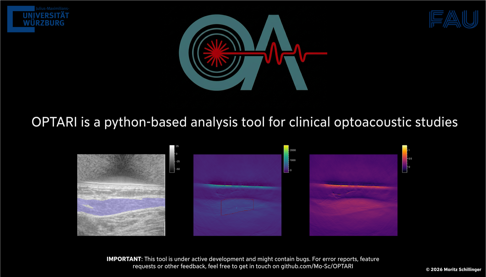

# OPTARI

**OPT**oacoustic imaging toolkit based on nap**ARI**: an open-source desktop application for analyzing
clinical photoacoustic/optoacoustic (OA) and ultrasound (US) studies.

OPTARI is an attempt to close the gap between engineering frameworks and clinical research in OA imaging. It combines a custom version of [PATATO](https://github.com/BohndiekLab/patato)
for data I/O and processing with [napari](https://napari.org) for multi-layer image
visualization, then adds a multi-patient study workflow, ROI annotation, automated tissue segmentation, and analysis tools required for clinical OA studies.

**Supported scan formats:**

- PATATO HDF5
- iThera MSOT Acuity Echo
- iThera Frontier (upcoming)

<!-- TODO: one-sentence description of each supported scanner/format -->

- :material-download: **First Time:**
  Read the [publication]() <!-- TODO: link to publication once available --> and start the [Installation](installation/index.md). Download the [test scans](developer-guide/contributing.md#test-data).

- :material-hospital-box: **Using OPTARI:**
  Read the [User Guide](user-guide/index.md) and see [Sample Workflow](clinical-workflows/manual-roi-workflow.md) examples.

- :material-cog: **Configuration:**
  Learn how to [customize](configuration/index.md) OPTARI and configure reconstruction, unmixing and segmentation adapters.

- :material-code-braces: **Contributing:**
  Read the [Architecture](developer-guide/architecture.md) and [Contributing](developer-guide/contributing.md) pages, as well as the [API reference](developer-guide/api-reference/patato-bridge.md).

## Scope of OPTARI

Most existing tools for OA-US analysis are either hardware-locked vendor software, or script-based engineering
frameworks aimed at algorithmic research. They are not intended for fast, multi-patient workflows in clinical
studies. OPTARI is built specifically as a graphical, non-programming interface that is intuitive to use and assists clinicians with automatic parameter selection and shareable configurations.

## Key Features

- Visualize US + OA scans from different clinical scanners.
- Browse multi-subject, multi-scan studies with fast switching and scrolling through frames/wavelengths.
- Draw, edit, and save ROIs, reuse them via a shareable ROI Library.
- Extract ROI intensities, plot ROI intensities over time and wavelength.
- AI-based tissue segmentation with automatic ROI placement.
- Reconstruction and spectral unmixing using PATATO and DeepMB, directly from the GUI.
- Load iThera `.msot`, PATATO HDF5, and IPASC HDF5 scans.
- Export to CSV/XLSX, open HDF5 with IPASC metadata, native IPASC raw data, or PNG/TIFF.

## Project Status

OPTARI is under active development. The source code, standalone installers, and example scans are available on
[GitHub](https://github.com/Mo-Sc/OPTARI) under the BSD-3-Clause license. Contributions and issue reports are
welcome (see [Contributing](developer-guide/contributing.md)). For license, citation, and funding information,
see [Credits](credits.md).
