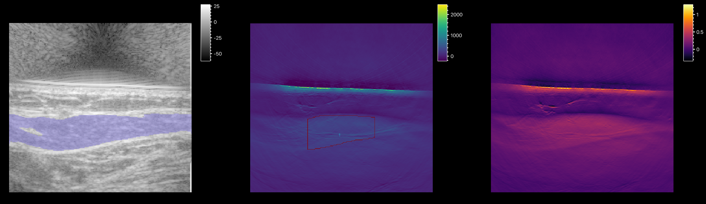

# PATARI

!!! note "Updated screenshots coming soon"
    The screenshots in this documentation are preliminary figures
    from previous versions and dont show the most recent version of PATARIs UI or features.
    Updated screenshots will be added soon.

!!! note "Batch Mode"
    The batch mode is missing in version 0.6.3.

**P**hoto**A**coustic imaging **T**oolkit based on nap**ARI** — an open-source desktop application for analyzing
clinical photoacoustic (PA) and ultrasound (US) studies.

PATARI is an attempt to close the gap between engineering frameworks and clinical research in PA imaging. It combines a custom version of [PATATO](https://github.com/BohndiekLab/patato)
for data I/O and processing with [napari](https://napari.org) for multi-layer image
visualization, then adds a multi-patient study workflow, ROI annotation, automated tissue segmentation, and analysis tools required for clinical PA studies.

**Supported scan formats:**

- PATATO HDF5
- iThera MSOT Acuity Echo
- iThera Frontier (upcoming)

<!-- TODO: one-sentence description of each supported scanner/format -->

- :material-download: **First Time:**
  Read the [publication]() <!-- TODO: link to publication once available --> and start the [Installation](installation/index.md).

- :material-hospital-box: **Using PATARI:**
  Read the [User Guide](user-guide/index.md) and see [Sample Workflow](clinical-workflows/manual-roi-workflow.md) examples.

- :material-cog: **Configuration:**
  Learn how to [customize](configuration/index.md) PATARI and configure reconstruction, unmixing and segmentation adapters.

- :material-code-braces: **Contributing:**
  Read the [Architecture](developer-guide/architecture.md) and [Contributing](developer-guide/contributing.md) pages, as well as the [API reference](developer-guide/api-reference/patato-bridge.md).

## Scope of PATARI

Most existing tools for PA-US analysis are either hardware-locked vendor software, or script-based engineering
frameworks aimed at algorithmic research. They are not intended for fast, multi-patient workflows in clinical
studies. PATARI is built specifically as a graphical, non-programming interface that is intuitive to use and assists clinicians with automatic parameter selection and shareable configurations.
<!-- TODO: sentence on how this hopefully helps clinical translation of PA imaging -->

## Key Features

- Visualize US + PA scans from different clinical scanners.
- Browse multi-subject, multi-scan studies with fast switching and scrolling through frames/wavelengths.
- Draw, edit, and save ROIs, reuse them via a shareable ROI Library.
- Extract ROI intensities, plot ROI intensities over time and wavelength.
- AI-based tissue segmentation with automatic ROI placement.
- Reconstruction and spectral unmixing using PATATO and DeepMB, directly from the GUI.
- Load iThera `.msot`, PATATO HDF5, and IPASC HDF5 scans.
- Export to CSV/XLSX, open HDF5 with IPASC metadata, native IPASC raw data, or PNG/TIFF.

## Project Status

PATARI is under active development. The source code, standalone installers, and example scans are available on
[GitHub](https://github.com/Mo-Sc/PATARI) under the BSD-3-Clause license. Contributions and issue reports are
welcome — see [Contributing](developer-guide/contributing.md). For license, citation, and funding information,
see [Credits](credits.md).

## Changelog

Release notes are published alongside each tagged release (see
[GitHub Releases](https://github.com/Mo-Sc/PATARI/releases)).

