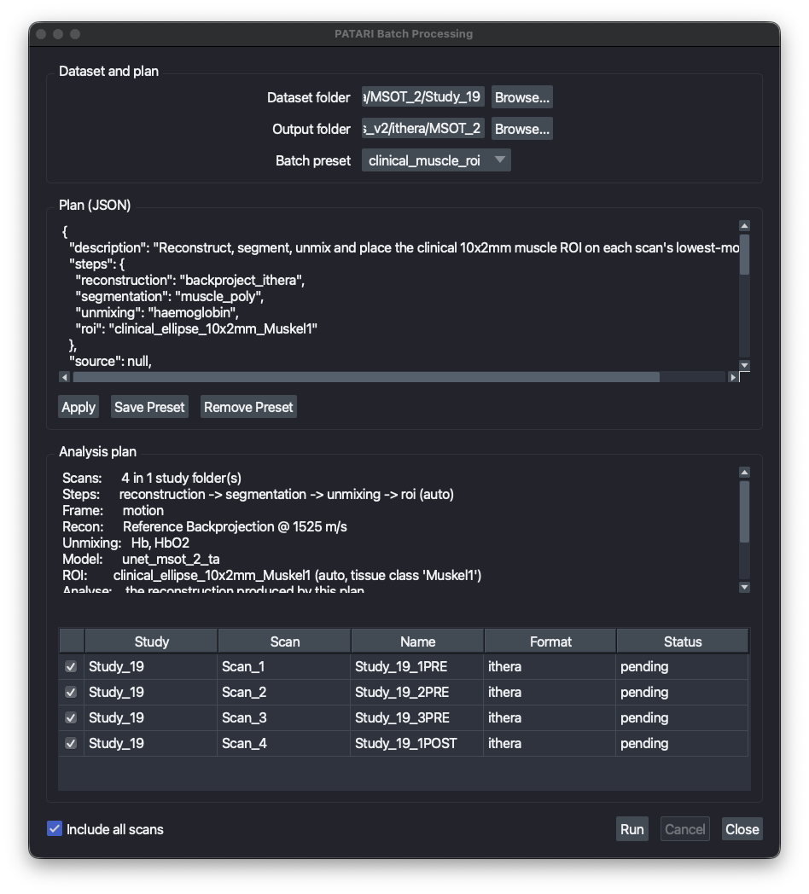

# Batch Processing

Batch mode applies one saved analysis to a whole dataset without supervision. The intended workflow is to tune the analysis on a single representative scan in the GUI, save each step as a preset, and then point batch mode at the study folder. Because batch mode drives the same controllers the docks do, the numbers it writes are the numbers you would have produced by hand.

Open it from the menu bar: **PATARI → Batch Processing…**





## Before you start

Batch mode runs presets, it does not create them. Set up and save the presets you want first:

| Step | Where you tune it | Preset folder |
| --- | --- | --- |
| Reconstruction | Reconstruction dock | `~/.patari/config/presets/reconstruction` |
| Segmentation | Segmentation dock | `~/.patari/config/presets/segmentation` |
| Unmixing | Unmixing dock | `~/.patari/config/presets/unmixing` |
| ROI | Annotation dock, **Save ROI preset** | `~/.patari/config/presets/roi` |

## The batch preset

A batch preset is a small JSON file in `~/.patari/config/presets/batch` that **names** the presets above rather than copying them. A step is a preset name and nothing else, so every setting has exactly one home and one thing to cite. Three are shipped: `clinical_muscle_roi`, `existing_recon_roi` and `convert_to_hdf5`.

```json
{
  "steps": {
    "reconstruction": "backproject_ithera",
    "segmentation": "muscle_poly",
    "unmixing": "haemoglobin",
    "roi": "clinical_ellipse_10x2mm_Muskel1"
  },
  "source": null,
  "frame": "motion",
  "measure": {"layers": "analysis", "all_channels": true, "all_frames": false},
  "outputs": {"xlsx": true, "hdf5": false, "overlay_png": true, "overlay_layer": null}
}
```

Every key is documented in [Presets](../configuration/presets.md#batch-presets-presetsbatch). In short: `steps` names what runs, `source` picks which reconstruction it runs on, `frame` picks which frame, `measure` says how wide to measure, and `outputs` says what to write.

Edit a plan directly in the batch window: the JSON editor shows the selected preset, **Apply** re-checks it, and **Save Preset** writes it back under a name of your choosing. Nothing needs editing by hand in `~/.patari`.

Note that how an ROI is placed (`static` or `auto`) belongs to the **ROI preset**, not the batch plan, so an ROI behaves the same whether you place it from the dock or from a batch run.

## Choosing which reconstruction to analyse

One batch run works on exactly one reconstruction. That reconstruction feeds unmixing, the ROI measurement and the overlay, so a scan that already contains several reconstructions still yields one unambiguous analysis.

The `source` key picks it, as a layer-name prefix:

- Leave it `null` alongside a `reconstruction` step to analyse the reconstruction the plan just produced.
- Set it to something like `"Recon: iThera"` and drop the `reconstruction` step to analyse a reconstruction already stored in each file. That is what the shipped `existing_recon_roi` preset does.
- Leaving it `null` with no `reconstruction` step falls back to the scan's default PA layer, and the window says so, since that is implicit rather than chosen.

With `measure.layers` at its default `"analysis"`, the table holds that reconstruction and what this run unmixed from it. Set it to `"all_pa"` to measure every PA layer in the scan instead, including reconstructions the plan did not make.

## Running

1. Pick the **dataset folder**. Any folder containing `Scan_*` entries counts as a study, so both `dataset/Study_1/Scan_1.hdf5` trees and a single flat folder of scans work.
2. Pick an **empty output folder**. Batch mode refuses to start if it already holds results from an earlier run.
3. Pick the **batch preset**.

The window then shows the resolved analysis plan and every scan it found. Anything that would make the run fail is listed before it starts, and **Run** stays disabled until the list is empty. Checks made up front include missing presets, an unknown segmentation model, an ROI whose `tissue_class` the chosen model never produces, unknown chromophores, and an overlay layer the plan would not generate.

Uncheck individual scans to leave them out. During the run each row gets a live status, and the viewer works through the dataset visibly. Leave it alone while it runs; **Cancel** stops after the current step.

When the run ends a summary dialog appears, listing any failures, and the per-scan statuses stay on screen so you can read them in place. Change the output folder to plan another run.

## Outputs

```
<output folder>/
  batch_roi_table.xlsx      # every measurement, all scans, same format as the GUI export
  batch_report.xlsx         # one row per scan: status, failed step, reason, timings
  batch_<timestamp>.log     # the full run log, including tracebacks
  overlays/<Study>_<Scan>_F<frame>_C<channel>.png
  hdf5/<Study>/<Scan>.hdf5
```

HDF5 export mirrors the input layout, so a converted dataset opens exactly like the original. Overlays stay in one flat folder, since flipping through them in order is the point.

`batch_roi_table.xlsx` is the main deliverable and is identical in shape to the [Saved Analysis export](exporting-data.md#saved-analysis-table-importexport-xlsx), so it imports back into the ROI dock and combines with tables from other sessions. Both it and the report are rewritten after **every** scan, so a run interrupted after four hours keeps everything measured so far.

## When a scan fails

A failing scan never stops the run. The failure is logged, that scan is marked `failed` in `batch_report.xlsx` with the step and reason, and the next scan starts. Typical per-scan failures are a corrupt or unreadable file, wavelengths the preset needs but the scan was not acquired at, an ROI that does not fit the scan's field of view, and a segmentation class absent from the analysis frame.

To retry only the failures, sort `batch_report.xlsx` by `status`, then run the same plan again into a new output folder with only those scans checked.

!!! tip "Converting vendor data in bulk"
    A plan with no steps and `hdf5` enabled is a pure format converter: it reads each vendor scan and writes it out as PATARI HDF5, with no analysis at all. That is what the shipped `convert_to_hdf5` preset does.

!!! warning "One run at a time"
    Batch mode uses the same single background-task slot as the docks. It refuses to start while another task is running, and the docks are disabled for the duration of a run.
