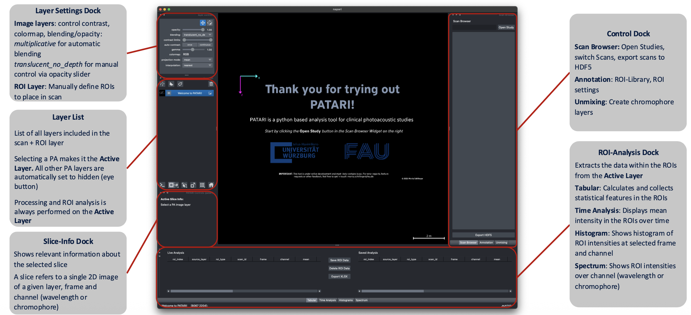

# User Guide Overview

PATARI's window is built from napari's dock system around a central image viewer. **Docks can be added or removed** by clicking `PATARI` in the menu bar and selecting `Docks`.

| Position | Docks |
|---|---|
| Left | **Layer List** and **Layer Controls** — napari's built-in docks for the loaded US, PA, and annotation layers |
| Right (tabbed) | **Scan Browser**, **Annotation**, **Segmentation**, **Unmixing**, **Reconstruction** |
| Bottom (tabbed) | **ROI Tables**, **Time Analysis**, **Histogram**, **Spectrum** |
| Center | The napari viewer — displays US, PA, and annotation layers |

In addition, there is an **Info** dock (showing metadata for the current scan/slice) that floats as its own window rather than docking to a fixed position.

You can drag dock tabs to rearrange them, and napari remembers your layout between sessions.

Most buttons, checkboxes, and other controls have a tooltip. Hover over one for a quick explanation of what it does before clicking.

## Pages in this guide

1. [Viewer & Navigation](viewer-and-navigation.md) — the Scan Browser, Layer List, and moving through frames and
   wavelengths.
2. [Metadata](metadata.md) — the metadata viewer's tabs, and editing clinical metadata.
3. [ROI Annotation](roi-annotation.md) — drawing ROIs, the Live/Saved tables, and the ROI Library.
4. [Temporal & Spectral Analysis](temporal-and-spectral-analysis.md) — plotting ROI intensity over time and
   wavelength, and viewing intensity histograms.
5. [Segmentation](segmentation.md) — automatic tissue detection and automated ROI placement.
6. [Reconstruction](reconstruction.md) — running PATATO reconstruction presets from the GUI.
7. [Unmixing](unmixing.md) — spectral unmixing and derived SO₂/THb parameters.
8. [Exporting Data](exporting-data.md) — HDF5, spreadsheet, and image/video export.
9. [Keyboard Shortcuts](keyboard-shortcuts.md) — the full shortcut reference.
10. [FAQ](faq.md) — common questions about everyday usage.

For examples of how we used PATARI in clinical PA studies, see [Sample Workflow](../clinical-workflows/manual-roi-workflow.md).
