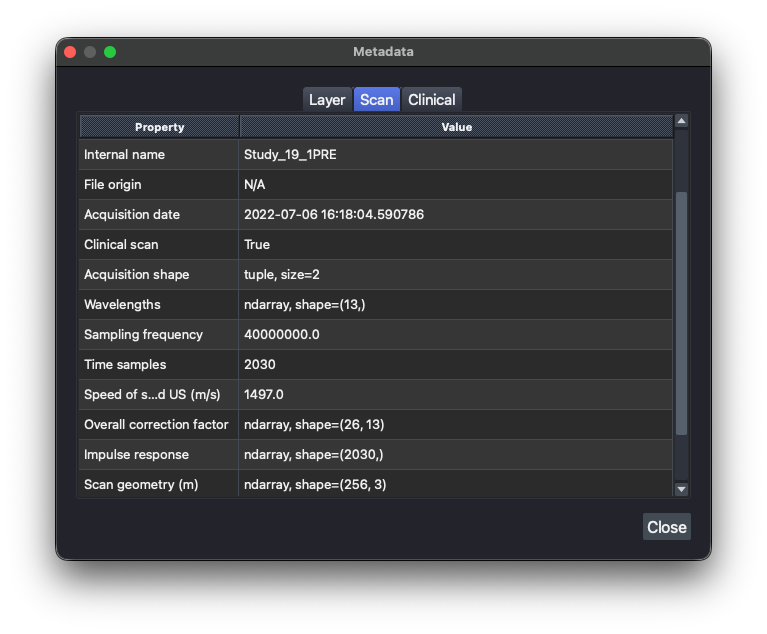

# Metadata

Click the metadata button in the **Info** dock to open the metadata viewer for the current scan/layer, organized into four tabs:

| Tab | Contents |
|---|---|
| Layer | Properties of the currently selected image layer (shape, scale, colormap, contrast limits, ...). |
| Scan | Acquisition settings, timestamps, and other fields carried over from the source file. |
| IPASC | Scan metadata mapped to the IPASC standard's field names and units. |
| Clinical | Clinical metadata (patient ID, notes, or any other free-form field), if the scan has any. |

Double-clicking a cell in the Layer, Scan, or IPASC tabs shows its full content. The **Clinical** tab is
editable: use **Add Row**/**Remove Row** and click **Save** to update it. Saved clinical metadata carries
over the next time you export the scan to HDF5 (see [Exporting Data](exporting-data.md)).

