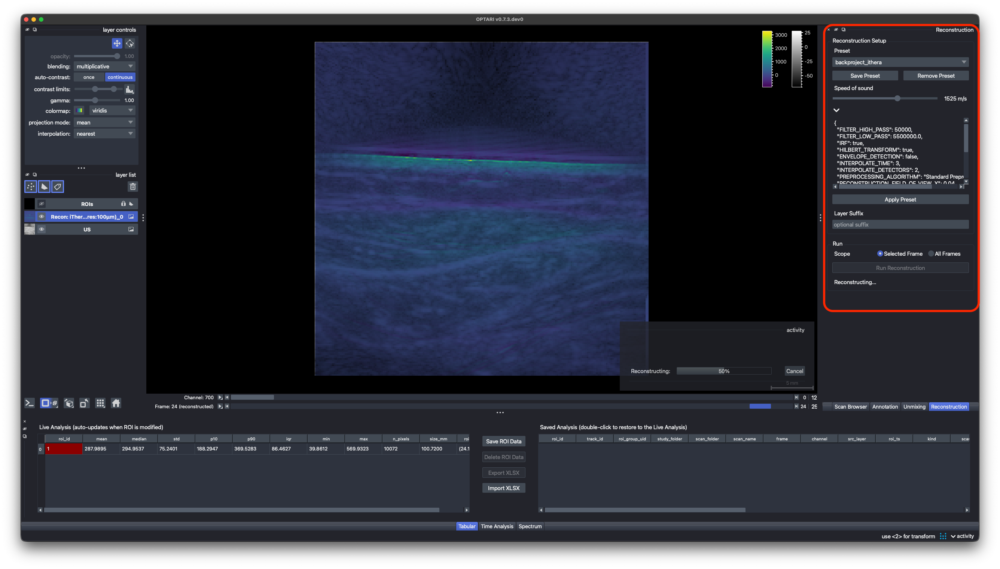

# Reconstruction

OPTARI includes a number of algorithms to reconstruct raw OA time series into 2D images:

A simple, but fast **backprojection algorithm** (delay and sum) is provided via the PATATO framework, as well as an experimental **model-based** reconstruction. We also implemented an adapter for the **DeepMB** reconstruction algorithm, a deep-learning model trained on clinical iThera Acuity data that reaches near-identical quality to iterative model-based reconstruction, at a fraction of the runtime.
DeepMB requires a pretrained model, which does not come with OPTARI by default, but might be provided by the authors upon reasonable request.

To create a new reconstruction, raw time series data must be available — either as HDF5 or in a vendor format that OPTARI can read.

**(1)** Choose a **reconstruction preset** from the drop-down menu. This sets parameters like reconstruction algorithm, filtering, and field-of-view. These reconstruction parameters and the preprocessing steps can be modified freely, by clicking on the `>` button (see [Presets](../configuration/presets.md)). If settings were changed, confirm by clicking `Apply Presets`. However, for scans recorded with clinical scanners from iThera, we recommend using one of the following presets:

- `backproject_clinical`: default reconstruction settings from PATATO. 
- `backproject_ithera`: default reconstruction settings from PATATO, but preprocessed with a 50kHz high-pass filter, resembling more closely the default iThera backprojection algorithm.
- `deepmb_ithera` (experimental): DeepMB, with settings for iThera MSOT Acuity Echo devices. Requires a pretrained model: `model_path` is the weights file, relative to the `models` folder of the OPTARI user directory or an absolute path, and an optional `model_url` lets OPTARI download it on first use.

**(2)** Adjust the **speed of sound** if needed.

!!! warning
      This will only change the speed of sound for the new OA reconstruction, not for the other layers in the scan. A wrong speed of sound can misalign the new layer with respect to the other images in the scan, like the US layer.

**(3)** Optional: add a **Layer Suffix**. This adds a custom string at the end of the default name that is given to the newly created reconstruction layer.

**(4)** Choose the **frame scope**. `Selected Frame` will only reconstruct the frame currently displayed in the viewer, `All Frames` will reconstruct all the available frames in the raw data.

!!! warning
      Reconstructing all frames can take some time, depending on the algorithm, image size, and number of frames and wavelengths.

**(5)** Run reconstruction. The resulting reconstructed images are added to the viewer as interactive OA layers, and can be used for analysis as well as exported.

!!! note
      Reconstruction runs in the background and can be interrupted via the Cancel button. The viewer stays fully interactive while it runs, but only one reconstruction, unmixing, or segmentation task can run at a time.
