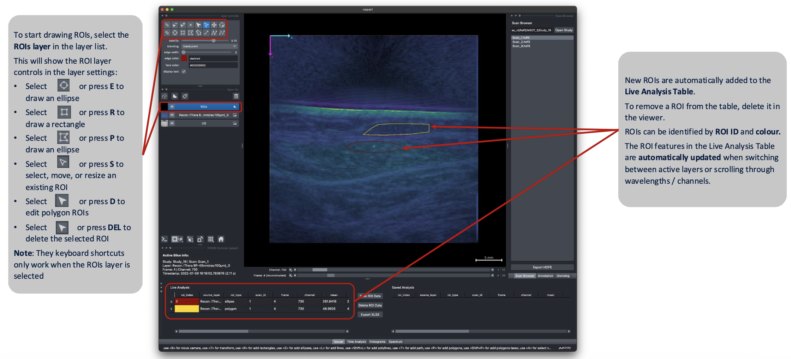
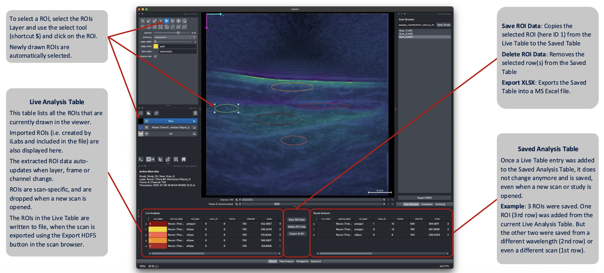
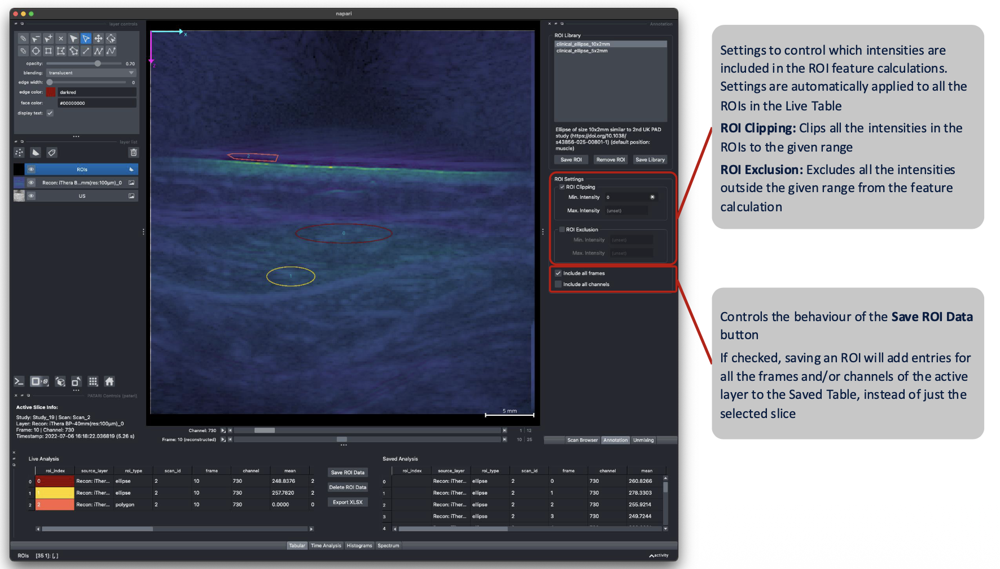
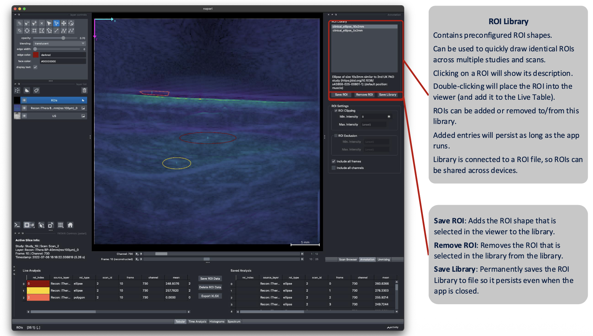

# ROI Annotation

<!-- TODO screenshot: roi-annotation-overview.png — ROI drawn on a PA/US overlay, with the Live Analysis table showing its statistics -->

## Drawing and editing ROIs

ROIs are drawn on the ROIs layer, directly on top of the image, using napari's built-in shape tools. To interact with ROIs, **make sure the ROIs layer is selected**. ROIs can be placed either by using the buttons in the layer controls panel (hovering will show their functions), or by using keyboard shortcuts:

- `E` — draw an ellipse · `R` — draw a rectangle · `P` — draw a polygon (double-click to finish)
- `S` — select an ROI to move or resize it · `A` — select all ROIs
- `Delete`/`Backspace` — delete the selected ROI(s)
- `Ctrl+C` / `Ctrl+V` (`Cmd` on macOS) — copy/paste selected ROI(s)

Full list in [Keyboard Shortcuts](keyboard-shortcuts.md).

!!! warning
    ROI deletion by keyboard only works when the shape is selected **in the viewer**, not when a row
    is selected in the Live Analysis table.

!!! tip
    The line shape (shortcut `L`) can be used as a **measurement tool for distances**. Simply draw a line along the distance you want to measure. The `size_mm` feature in the Live Analysis table will display its length in mm — see [FAQ](faq.md#can-i-measure-distances-in-patari).

## Live Analysis vs. Saved Analysis tables

PATARI uses a dual-table system so you can get live information to place the ROI, but choose only selected ROIs for analysis:

### Live Analysis

The entries in the Live Analysis table recompute automatically whenever you draw, move, resize, an ROI, or scroll to a different wavelength or chromophore. A ROI always belongs to a single frame (the one selected at ROI creation). To duplicate a ROI across multiple frames, you can either use copy paste on the selected ROI, or save the selected ROI to the [ROI Library](#roi-presets) and place it again on the next scan.

### Saved Analysis

The Saved Analysis table is used to collect ROI data for subsequent analysis. Press `Shift+Ctrl+S` (`Shift+Cmd+S`) or use the **Save ROI Data** button to add the current ROI measurements to the Saved Analysis table. The entries in this table are frozen, and persist for the entire runtime of the application. To delete an entry from the Saved Analysis table, select the row and press the **Delete ROI Data** button.

Clicking the **Export XLSX** button will export the entries in the Saved Analysis table to a Microsoft Excel file that can be used for further analysis.

Sometimes it can be helpful to use the same ROI across multiple layers (i.e. reconstructions and unmixed), channels (i.e. multiple wavelengths or chromophores), or frames (if motion is low). This can be achieved by checking the **Include all layers/frames/channels** checkboxes in the **Annotation** tab in the right dock. If checked, instead of a single entry, the **Save ROI Data** button will add an entry for every layer/frame/channel in the selected scan to the Saved Table, using the currently selected ROI.

<!-- TODO screenshot: roi-live-saved-tables.png — Live Analysis and Saved Analysis tables side by side -->

### ROI Features

ROI feature describes a property of the ROI or a statistical measure by which the intensities in the ROI are summarized. A list of included features can be found in the [Configuration Schema](../configuration/configuration-schema.md). Which features appear in the Live Analysis table can be [configured](../configuration/configuration-schema.md#annotation).

!!! note
    This selection only affects what's **displayed in the table**. It's an option to visually declutter the table. Saving or exporting a measurement always computes and stores the **full feature set**, regardless of which columns are currently visible.

## Intensity Handling

The Annotation dock lets you choose how out-of-range pixel values within an ROI are handled before statistics are
computed:

- **ROI Clipping** — clamp values to a min/max range.
- **ROI Exclusion** — drop out-of-range pixels entirely before computing statistics.

Setting values here automatically updates the entries in the Live Analysis table.

## ROI Presets

To place the same ROI consistently across multiple frames, scans, or clinical studies, a ROI can be saved to the **ROI Presets** library. 

- **Place a ROI:** Select a ROI preset from the list by clicking on it. Additional information about that ROI will be shown (if available). To place the ROI on the viewer, double-click the list entry, or click the **Apply Preset** button.
- **Scope:** `Selected Frame` will place the ROI only on the currently selected frame in the viewer. `All Frames` will duplicate the ROI across all the frames in the selected layer.
- **Create a Preset:** Select a ROI shape in the viewer and click the **Save Preset** button. A popup will ask you for a ROI name, and optional position and description attributes.

The ROI Presets library is constantly synced with a [`.json` file](../configuration/presets.md#roi-presets-presetsroi). This file can be used to share ROI shapes across computers or institutions.

### Placement Mode

By default, ROI placement is set to `static`, meaning the ROI will be placed at the exact coordinates defined in the preset. 

However, if it is set to `automatic`, PATARI will try to automatically place the ROI in the tissue that is defined as the `position` attribute in the preset, ignoring the coordinates. This requires the scan to have a [**Segmentation**](segmentation.md) layer that contains a class with the same name as the one set in the position attribute. If no Segmentation layer or no corresponding tissue class is found, it will default back to static placement.

<!-- TODO screenshot: roi-library.png — ROI Library / presets panel -->
