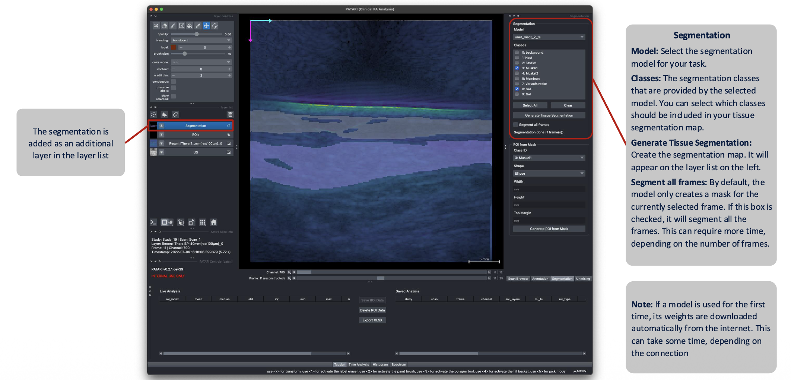
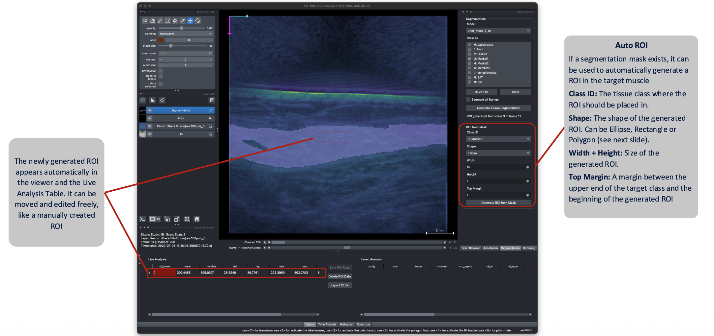
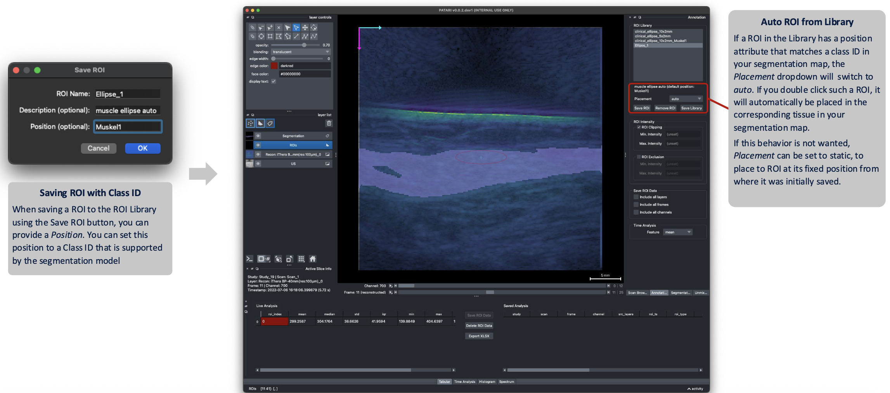

# Segmentation & Auto-ROI

<!-- TODO screenshot: segmentation-overview.png — Segmentation dock with a generated tissue mask overlaid on the US image -->

OPTARI includes a deep-learning-based segmentation module to generate tissue maps from the US scans, as well as to automatically place ROIs in the target tissue. 

## Running segmentation

1. In the **Segmentation** dock, choose a **model** from the registry. OPTARI comes with a pretrained model for three clinical examination sites that are common in PA imaging (see [Segmentation Models](../configuration/segmentation-models.md)).
2. The **Classes** list shows the available tissue classes for the selected model. Pick which classes to segment.
3. **Scope** chooses whether the segmentation map will be generated only for the currently selected frame or for all the frames in the scan.
4. Click **Generate Tissue Segmentation** (or press `Shift+Ctrl+T` / `Shift+Cmd+T`).

The result is added to the viewer as `Segmentation` layer.

!!! note
    The default model weights are downloaded automatically the first time a given model is used, into the `~/.optari/models` folder. This requires an internet connection once. Inference runs locally via ONNX Runtime, and falls back to CPU automatically if no compatible GPU is available.

!!! note
      Segmentation runs in the background and can be interrupted via the Cancel button. The viewer stays fully interactive while it runs, but only one reconstruction, unmixing, or segmentation task can run at a time.
    
## Automatic ROI placement

Once a segmentation mask exists, OPTARI can place an ROI directly inside the target tissue class:

- **Class ID** — which segmented class to place the ROI in (must be in the segmentation mask).
- **Shape** — ellipse, rectangle, or polygon. The polygon simply follows the outline of the segmented target tissue.
- **Width / Height / Top margin** — geometry of the placed ROI, in mm.

The placement strategy always centers the ROI horizontally and places it as high as possible within the target region (minus the top margin), since that is usually the area with the highest sensitivity in the scan.

## Presets

At the top of the **Segmentation** dock, you can also choose between different presets, which will automatically fill the dock with preconfigured settings. To create a new preset, set the configuration as desired and press the **Save Preset** button.

## Auto ROI using the ROI Library

Segmentation-based placement can also be combined with the ROI Library ([See Placement Mode](roi-annotation.md#placement-mode)). If a class in the segmentation mask matches a saved ROI preset's position attribute, it will be automatically placed in the corresponding tissue. If a segmentation mask is available for all scans and **Scope** in the Annotation dock is set to `All Scans`, the ROI will be dynamically placed using each frame's segmentation mask.

<!-- TODO screenshot: segmentation-auto-roi.png — automatic ROI placement result on segmented tissue -->

!!! note
    Automated placement quality depends on how close the current scan is to the model's training distribution. New anatomical sites or scanner types might require fine-tuning the model. See [FAQ](faq.md#automatic-roi-placement-looks-wrong-for-my-scan).
