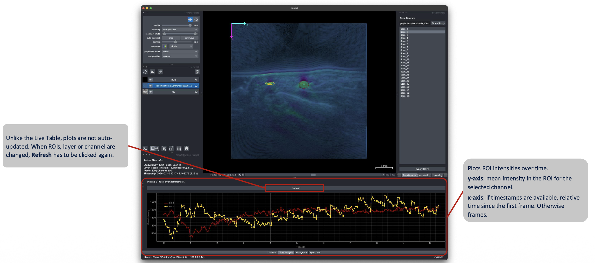
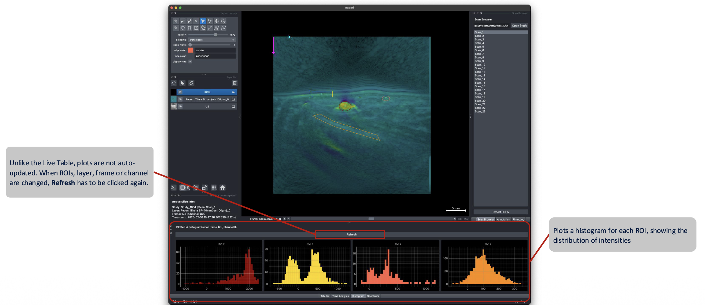
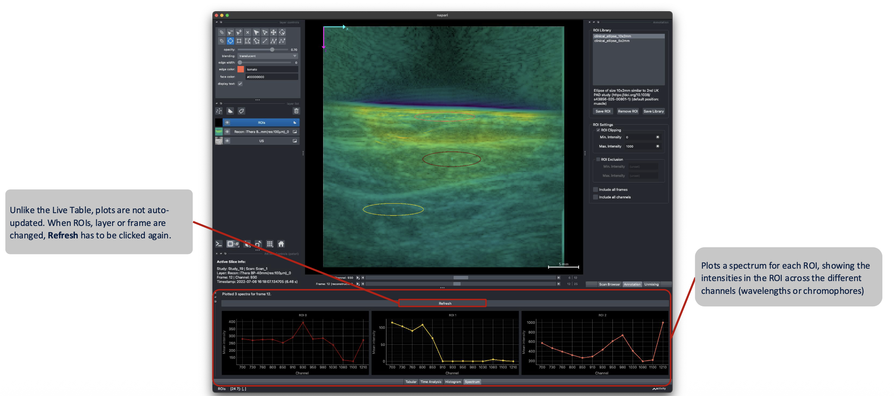

# Temporal & Spectral Analysis

The three tabs next to the Analysis tables are used to visualize the data in the ROIs that are shown on the viewer. For performance reasons, they are not auto-updated, but are generated by clicking on the **Refresh** button.

## Time Analysis

Plots the selected layer and channel's intensity for all currently active ROIs, across every acquisition frame, using timestamps for the x-axis where available.

The ROI feature for the y-axis can be selected in the Annotation dock on the right by changing the **Time Analysis** - **Feature** setting. By default, the mean intensity is plotted.

!!! note
    Features like `size_mm` or `n_pixels` are constant by default, but become informative when combined with the **Exclude** intensity mode (see [ROI Annotation](roi-annotation.md#intensity-handling)) — for example, plotting the number of pixels above a threshold over time.

## Histogram

Plots separate pixel-intensity distributions for each active ROI, for the currently selected layer, frame and channel, using the bin count configured in [`config.json`](../configuration/configuration-schema.md) (`analysis.histogram_bins`).

## Spectrum

Plots per-ROI mean intensity across channels (i.e. wavelengths), showing the spectral signature of the tissue inside the selected ROI.

All three plots respect the intensity clip/exclude filtering defined in the **Annotation** dock.

By right-clicking into the plot window, you can configure each plot's axis ranges and apply additional filters or transforms, as well as **exporting the plot to PNG** and other file formats. By holding both mouse buttons and dragging the window, the view can be adjusted as well.
