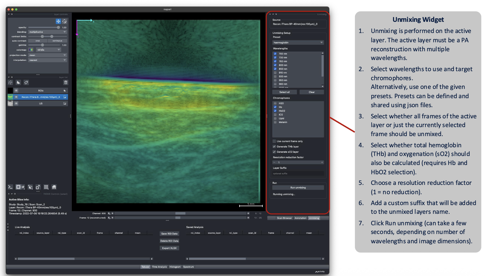
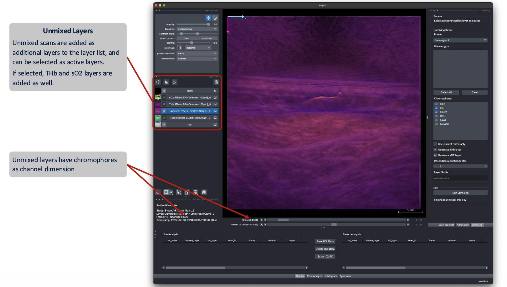

# Unmixing

<!-- TODO screenshot: unmixing-dock.png — Unmixing dock with chromophores and derived SO2/THb layers -->

PATARI can unmix PA scans recorded at different wavelengths into chromophore concentration maps, using linear spectral unmixing. At each pixel, PATARI (via PATATO) multiplies the multi-wavelength signal by the Moore-Penrose pseudoinverse of the selected chromophores' reference spectra and solves the mixing model by least squares.

**(1)** In the **Unmixing** dock, choose a **preset**, or select a wavelength range and chromophore set manually. Make sure a **PA reconstruction is selected** as the active layer in the **Layer List**.

!!! note
      Reference spectra are available for water, oxygenated (HbO2) and deoxygenated hemoglobin (Hb), indocyanine green (ICG), lipid, and melanin.

!!! warning
      Reference spectra for Hb and HbO2 are only available up to 1000nm. Selecting higher wavelengths for unmixing will cause it to fail. 

**(2)** Optional: enable derived parameters: **SO₂** (oxygen saturation) and **THb** (total hemoglobin).

**(3)** Optional: Set a **resolution reduction factor**. This will combine multiple pixels in the underlying reconstruction into one by taking their mean. This can also be used as a simple form of motion correction.

**(4)** Optional: add a **Layer Suffix**. This adds a custom string at the end of the default name that is given to the newly created unmixed layer.

**(5)** Choose the **frame scope**. `Selected Frame` will only unmix the frame currently displayed in the viewer, `All Frames` will unmix all the available frames in the underlying reconstruction.

**(6)** Run unmixing. The resulting chromophore concentration maps (and SO₂/THb, if enabled) are added to the viewer as interactive PA layers, and can be used for analysis as well as exported.

Presets can be saved and reloaded so the same processing configuration is reproducible across scans and shareable
with collaborators (see [Presets](../configuration/presets.md)). To save the current configuration as a preset, click the `Save Preset` button.

!!! note
      Unmixing runs synchronously. The interface is briefly unresponsive while the unmixing runs, depending on the size of the scan.
