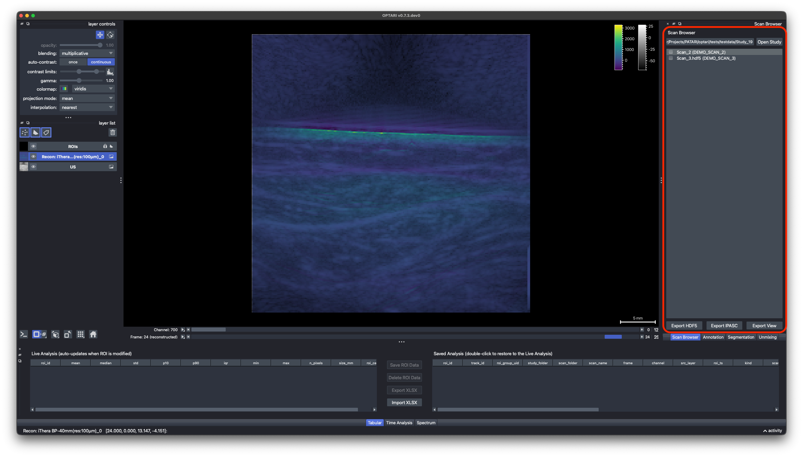
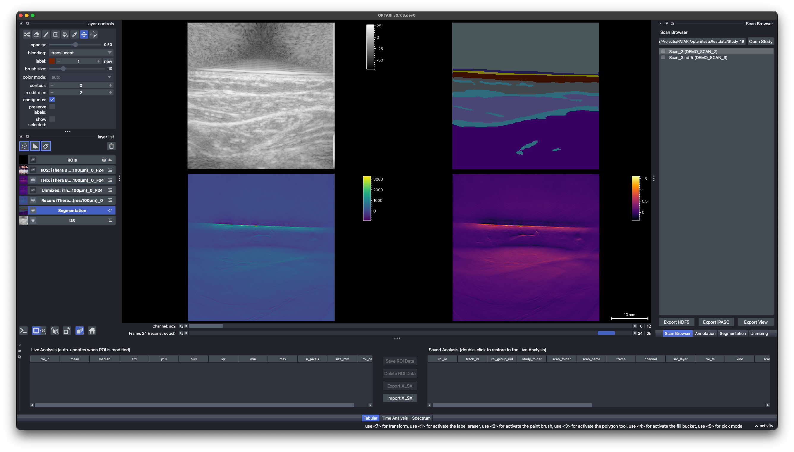

# Viewer & Navigation

## Scan Browser

The **Scan Browser** dock lists available scans in the selected folder.

1. Open Study: Select a study folder. OPTARI discovers both iThera-native (`Scan_` folders containing `.msot` files) and compatible HDF5 files (`.hdf5`).
2. Click a scan in the list to load it. If both an iThera and an HDF5 version of the same scan exist, OPTARI
   prefers the HDF5 one.
3. Switch scans: The viewer, ROIs, and analysis docks update to the newly selected scan.

## The Image Viewer

- **Layer List** shows every dataset in the scan as a separate layer: the US image, one or more
  OA reconstructions, unmixed images, etc. as well as the ROI shapes layer that contains loaded and user drawn ROIs. By default the US layer and one OA layer (recon or unmixed) are set to visible. Clicking on another OA layer will automatically select it and set the other OA layers invisible. **Visibility** can be controlled with the eye icon. The order of the layers can be changed by dragging them with the cursor. The currently selected layer is marked by its blue background.
- **Layer Controls** adjust **opacity**, **contrast limits**, and **colormap** for the currently selected layer in the layer list.
  Layers blend multiplicatively by default for clean overlays. By default, contrast limits are adapted automatically for each slice. To **finetune the contrast limits**, right click on the contrast limits slider. Click the histogram button next to the contrast limit slider, to see the **histogram** of the selected image. If the ROI layer is selected, annotation-specific layer controls are available (see [ROI Annotation](roi-annotation.md)).
- **Sliders** at the bottom of the viewer, you can scroll through frames and channels (wavelengths or chromophores). Use the `Left`/`Right` arrow keys as a faster alternative (see [Keyboard Shortcuts](keyboard-shortcuts.md)). The available frames and channels depend on the active layer (the OA layer selected in the layer list). This means if the selected layer has only one frame (for example because only one was reconstructed), the frame slider won't allow scrolling, even if other layers in the layer list provide more frames. The **playback button** next to the frame slider plays through the frame sequence automatically. Right-click it to change the playback frame rate (speed).

!!! tip
    To set a specific, **fixed contrast limit** for all frames and channels instead of auto-scaling, select the respective layer from the Layer List and click the auto-contrast `once` button in the layer controls panel. This switches off `continuous`, which OA layers have on by default, and the contrast limits stay constant.

## Automatic frame selection

By default, OPTARI scores every US frame for motion, using an algorithm that combines structural similarity and
zero-mean normalized cross-correlation. When a new scan is loaded, it automatically selects the frame with lowest motion. This is an attempt to reduce operator variability in frame selection. It can be turned off in
[`config.json`](../configuration/configuration-schema.md) (`general.DEFAULT_FRAME_INDEX`).

## Grid mode

Press `Ctrl+G` (`Cmd+G` on macOS) or click the grid mode icon below the layer list to view multiple layers side by side instead of
overlaid. Every visible layer gets its own cell, in the same order as the layer list (top left is the top of the list). The ROIs layer is shown in its own cell too, so ROIs are
not drawn on top of the images in grid mode. See [Why can't I see ROIs overlaid on images in grid mode?](faq.md#why-cant-i-see-rois-overlaid-on-images-in-grid-mode)
for the reason.

!!! note
    OPTARI does not yet support a true multi-viewer layout with synchronized annotations across separately
    scrolling panes. The grid mode shows layers side by side, but they share one set of dimension sliders, so it is not a real substitute. This is currently a napari limitation and will hopefully be added soon. 

**Alternative:** It is also possible to launch OPTARI twice to have completely disentangled windows, for example to compare different scans. But keep in mind that this means ROIs and other data are not synced between the instances.

For the current scan/layer's metadata, see [Metadata](metadata.md).

