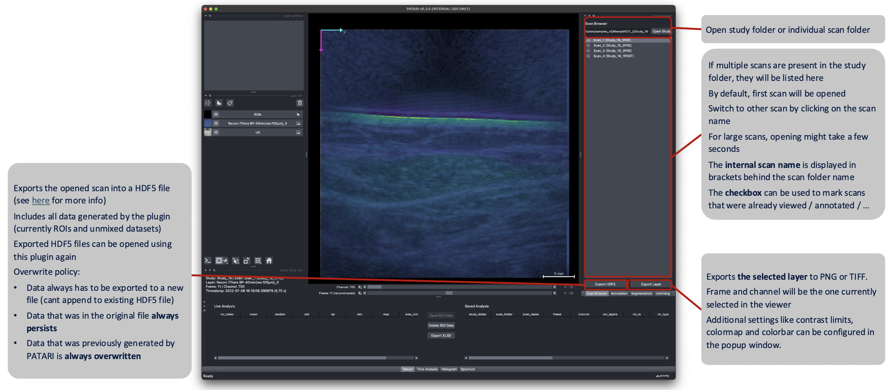
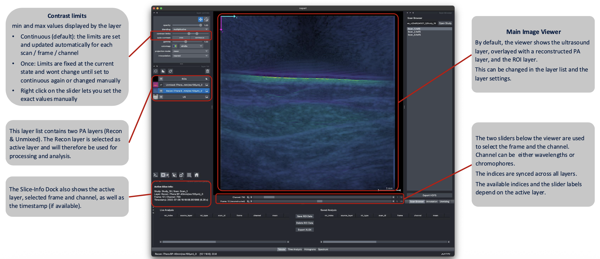
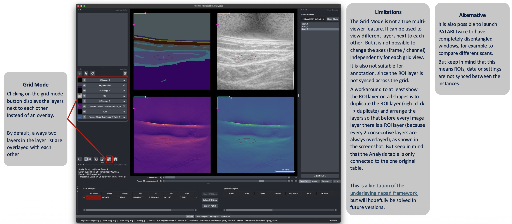

# Viewer & Navigation

<!-- TODO screenshot: viewer-overview.png — main viewer window with Scan Browser, Layer List, and Info dock labeled -->

## Scan Browser

The **Scan Browser** dock lists available scans in the selected folder.

1. Open Study: Select a study folder. PATARI discovers both iThera-native (`Scan_` folders containing `.msot` files) and compatible HDF5 files (`.hdf5`).
2. Click a scan in the list to load it. If both an iThera and an HDF5 version of the same scan exist, PATARI
   prefers the HDF5 one.
3. Switch scans: The viewer, ROIs, and analysis docks update to the newly selected scan.

## The Image Viewer

- **Layer List** shows every dataset in the scan as a separate layer: the US image, one or more
  PA reconstructions, unmixed images, etc. as well as the ROI shapes layer that contains loaded and user drawn ROIs. By default the US layer and one PA layer (recon or unmixed) are set to visible. Clicking on another PA layer will automatically select it and set the other PA layers invisible. **Visibility** can be controlled with the eye icon. The order of the layers can be changed by dragging them with the cursor. The currently selected layer is marked by its blue background.
- **Layer Controls** adjust **opacity**, **contrast limits**, and **colormap** for the currently selected layer in the layer list.
  Layers blend multiplicatively by default for clean overlays. By default, contrast limits are adapted automatically for each slice. To **finetune the contrast limits**, right click on the contrast limits slider. Click the histogram button next to the contrast limit slider, to see the **histogram** of the selected image. If the ROI layer is selected, annotation-specific layer controls are available (see [ROI Annotation](roi-annotation.md)).
- **Sliders** at the bottom of the viewer, you can scroll through frames and channels (wavelengths or chromophores). Use the `Left`/`Right` arrow keys as a faster alternative (see [Keyboard Shortcuts](keyboard-shortcuts.md)). The available frames and channels depend on the active layer (the PA layer selected in the layer list). This means if the selected layer has only one frame (for example because only one was reconstructed), the frame slider won't allow scrolling, even if other layers in the layer list provide more frames.

!!! tip
    To set a specific, **fixed contrast limit** for all frames and channels instead of auto-scaling, select the respective layer from the Layer List, click the auto-contrast: `continuous` button in the layer controls panel and then click the `once` button. The contrast limits are now constant.

## Automatic frame selection

By default, PATARI scores every US frame for motion, using an algorithm that combines structural similarity and
zero-mean normalized cross-correlation.
<!-- TODO: cite motion-scoring reference/paper -->
When a new scan is loaded, it automatically selects the frame with lowest motion. This is an attempt to reduce operator variability in frame selection. It can be turned off in
[`config.json`](../configuration/configuration-schema.md) (`general.DEFAULT_FRAME_INDEX`).

## Grid mode

Press `Ctrl+G` (`Cmd+G` on macOS) or click the grid mode icon below the layer list to view multiple layers side by side instead of
overlaid. This will show layers next to each other in pairs of two, meaning two consecutive layers will always be overlaid. This is a workaround to be able to see ROIs on top of images. To change which layers are overlaid and which ones are displayed next to each other, switch the order of the layers in the layer list.

!!! note
    PATARI does not yet support a true multi-viewer layout with synchronized annotations across separately
    scrolling panes. The grid mode shows layers side by side, but they share one set of dimension sliders, so it is not a real substitute. This is currently a napari limitation and will hopefully be added soon. 

**Alternative:** It is also possible to launch PATARI twice to have completely disentangled windows, for example to compare different scans. But keep in mind that this means ROIs and other data are not synced between the instances.

## Metadata

Click the metadata button in the **Info** dock to open a read-only viewer for the current scan/layer's metadata
(acquisition settings, timestamps, and other fields carried over from the source file). Double-clicking on a cell shows the full content. If the scan contains clinical metadata, it is also shown here.

<!-- TODO screenshot: viewer-metadata-dialog.png — layer metadata dialog -->
